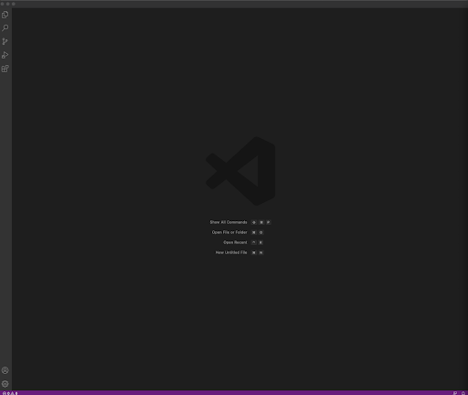
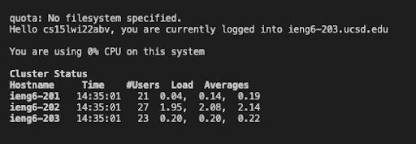
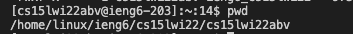
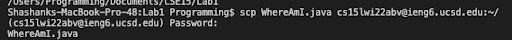

# Hi welcome to Lab Report 1 Week 2

In this page you will learn how to log into your course specific account on UCSD computers on ieng6. Note this is targeted towards those on UNIX systems.

## Step One: Installing VSCode

Search for the VSCode download on google and download the dmg. From there unzip the file and open your VSCode. You should see a screen something like this:

## Step Two: Remotely Connecting

In order to remotely connect you first need to set up your username and password for your UCSD CSE15 account. Go to the ETS Account management system to reset your password and then wait 15 minutes for the password reset to take place.

Once your account password is set, you can now connect via SSH for the first time. Enter the command:

`ssh yourAccountName@ieng6.ucsd.edu`

note: the yourAccountName should look like `cs15lwi22xxx`

After running the command you will be prompted to enter your password, which you should go ahead and do, and from there you will see a successful connection like this:

## Step Three: Running Commands

Now lets go ahead and try to run some commands on `ieng6`

Note: your terminal should no longer list your personal computer and should have something like:
`[cs15lwi22xxx@ieng6-203]:~:14$ `

Try running the command: `pwd`

And you should see an output like this:

## Step Four: Moving Files with `scp`

In order to take code you have written on your computer and run it on ieng6 you first need to move the respective files onto ieng6 to compile and run. In order to send files over ieng6 you can use the `scp` command as following:

`scp fileName.fileExtension cs15lwi22xxx@ieng6.ucsd.edu~/`

What this command does is takes the first argument, the file you want, and sends it to the address in the second argument. Note the `~/` which tells scp to place the file in your default directory when you log into ieng6 under your account (which should be your folder).

After hitting enter you will be prompted to enter your password, and when the `scp` is successful the terminal will print back the name of the file you transferred over, and it should look like this:

