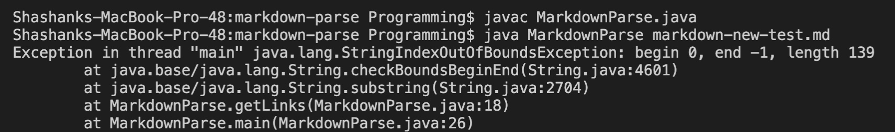

# Hi welcome to Lab Report 2 Week 4

In this lab report I will be going over 3 code changes my group made during lab 3 and lab 4, and explain the bugs, symptoms, and failure inducing input that led to these code fixes.

## Code Change 1:
Screenshot of code change:

Link to test file of failure input:
[test-file4.md](https://shashankvenkatramani.github.io/cse15l-lab-reports/lab-report-2-files/test-file7.md)

Screenshot of code symptom:

The bug was that we never did any validation on the link itself. We would take whatever was after a bracket and then look for the end of the line, or an end parenthesis, or anything to indicate the end of text, but we never checked if the text itself was a link. As a result of this there was the symptom that non links that were after a bracket would still be parsed and outputted. Looking at the test file it can be seen that there is an end bracket, with “link goes here!” after, which is not a link, but still got registered as one.

In order to fix this we added a quick validation that checked if there was a period within the string for the link we extracted as a validation check.

## Code Change 2:
Screenshot of code change:

Link to test file of failure input:
[markdown-new-test.md](https://shashankvenkatramani.github.io/cse15l-lab-reports/lab-report-2-files/markdown-new-test.md)

Screenshot of code symptom:

The bug in this case was that we would go straight from the close bracket to the next open parenthesis, without checking if it existed or not, and then do a substring with no invalid values check. This caused the symptom that if either parenthesis was not found, it would hit an indexoutofbounds exception when doing the substring. The failure inducing input included links such as “​​[hi]thiswillbreak.com”, and there were no other parentheses in the file causing it to hit the out of bounds symptom.

In order to fix this we added a check to see if either parenthesis value was -1 for index of, and from there tried to approximate it using other known values, such as the close bracket or the end of the line

## Code Change 3
Screenshot of code change:

Link to test file of failure input:
[test-file7.md](https://shashankvenkatramani.github.io/cse15l-lab-reports/lab-report-2-files/test-file7.md)

Screenshot of code symptom:

The bug in this case was that it would find the nextOpenBracket, but couldn’t find a close bracket, and there was no check for if the next parenthesis found was after the openBracket, as it compared it to the closeBracket which was -1. It would find a close parenthesis that was before the open bracket, and find out it was an invalid link when trying to fill in the end and start of the link. The infinite loop came in since the currentIndex would be set to closeParen + 1, and it would just find the same nextOpenBracket, and repeat this process again. This led to the symptom of there being an infinite loop, and this can be seen as caused by the failure inducing input of test-file7.md where it had a close parenthesis before an open bracket in line 1 “)[“

In order to fix this we changed how the code functioned from the ground up, instead of focusing on parenthesis and brackets we first looked for periods, and then expanded outwards until we hit "stop characters", such as parenthesis, brackets, a new line character etc. and this caused it to pass all test cases.
