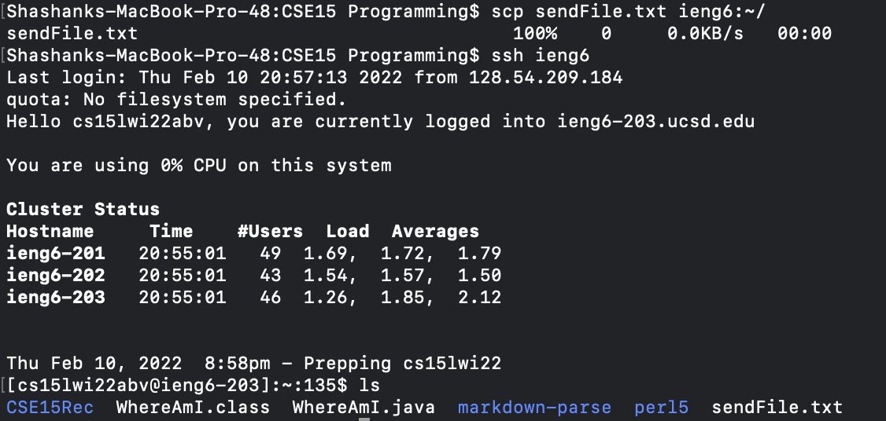

# Lab Report 3 Week 6

Here I nano'd into the config file. As we can see the Host ieng6 line denotes the alias "ieng6" that has all of the relevant info. The HostName contains the address of the server which is ieng6.ucsd.edu, the User is my user's account, and finally the IdentityFile links the correct rsa private key to use to sign in via SSH without the need for a password. Now I can simply do commands with ieng6 alias, and all of the relevant information will be passed through.

In this example I do ssh ieng6 (without any other details such as the server address, user etc). As you can see it says `Hello cs15lwi22abv` which is the User that I chose in the config file. It successfully logged into ieng6 and I Am now able to run any commands that I like.

In this example I created a blank file called `sendFile.txt` which I then used the scp command to transfer over. I included `sendFile.txt` so it knows what file to send, and additionally put the alias `ieng6` so it knows the server to send it to. Additionally it has the `:~/` so that it knows to place the file in the root directory. As we can see with the `100%` the file is successfully sent. Sshing back into ieng6 and using the `ls` command, it can be seen that the `sendFile.txt` file is present in the root directory.
