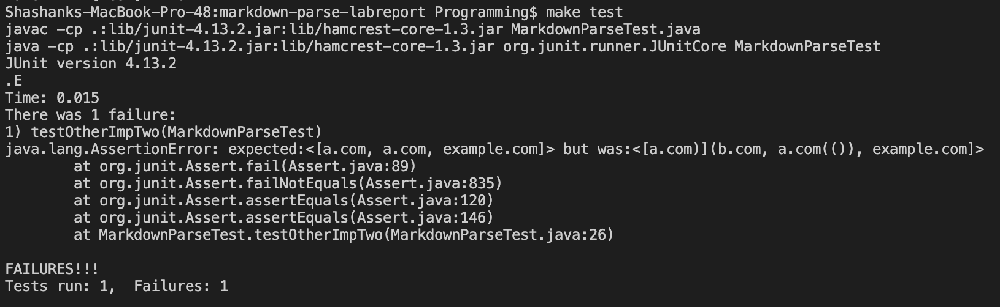

# Lab Report 4 Week 8
My markdown repository: https://github.com/ShashankVenkatramani/markdown-parse/

Other markdown repository: https://github.com/bimai25/markdown-parse-brandon/blob/main/MarkdownParse.java

## Test One


Looking at the preview we can see that only the last 3 links are clickable on the preview. So we get an expected output of:

```
{"`google.com", "google.com", "ucsd.edu"}
```

Code to test for above:

```
@Test
public void testMyImpOne() throws IOException {
    Path fileName = Path.of("snippetOne.md");
    String contents = Files.readString(fileName);
    assertEquals(List.of("`google.com", "google.com",
        "ucsd.edu"), MarkdownParse.getLinks(contents));
}
@Test
public void testOtherImpOne() throws IOException {
    Path fileName = Path.of("snippetOne.md");
    String contents = Files.readString(fileName);
    assertEquals(List.of("`google.com", "google.com",
        "ucsd.edu"), MarkdownParseOther.getLinks(contents));
}
```

### My implementation

Output from running test on my implementation:


For snippet one, the specific output is `testMyImpOne` with the line:
```
expected:<[`google.com, google.com, ucsd.edu]> but was:<[url.com, `google.com, google.com, ucsd.edu]>
```

Output from running tests on their implementation:


For snippet one, the specific output is `testOtherImpOne` with the line:

```
expected:<[`google.com, google.com, ucsd.edu]> but was:<[url.com, `google.com, google.com]>
```

This will be a much larger code change in order to fix my implementation for test one. I capture the proper links correctly, however the code captures a false positive of "url.com". In order to account for this I would need to add a whole check for markdown link validation, as the current code works by searching for periods and then expanding outwards until it hits stop characters, regardless of if its a broken markdown link or not.

## Test Two


Looking at the preview we can see that the b.com is not a link, but the other three are valid links.

```
{"a.com", "a.com", "example.com"}
```

Code to test for above:

```
@Test
public void testMyImpTwo() throws IOException {
    Path fileName = Path.of("snippetTwo.md");
    String contents = Files.readString(fileName);
    assertEquals(List.of("a.com", "a.com", "example.com"),
        MarkdownParse.getLinks(contents));
}
@Test
public void testOtherImpTwo() throws IOException {
    Path fileName = Path.of("snippetTwo.md");
    String contents = Files.readString(fileName);
    assertEquals(List.of("a.com", "a.com", "example.com"),
        MarkdownParseOther.getLinks(contents));
}
```

### My implementation

Output from running test on my implementation:


For snippet two, the specific output is `testMyImpTwo` with the line:
```
expected:<[a.com, a.com, example.com]> but was:<[a.com, b.com, a.com, example.com]>
```

Output from running tests on their implementation:



For snippet one, the specific output is `testOtherImpTwo` with the line:

```
expected:<[a.com, a.com, example.com]> but was:<[a.com)](b.com, a.com(()), example.com]>
```

Similar to snippet one, in order to make my code work for snippet two it would involve a large code change. Since I scan for every link within the markdown without checking if its a valid markdown link, it captures the false positive of b.com. In order to fix this it would require validation of the surrounding syntax around a link, and would not be a <10 lines change.

## Test Three


Looking at the preview we can see that the only clickable link is sourced from https://ucsd-cse15l-w22.github.io/, so we have an expected output:

```
{"https://ucsd-cse15l-w22.github.io/"}
```

Code to test for above:

```
@Test
public void testMyImpThree() throws IOException {
    Path fileName = Path.of("snippetThree.md");
    String contents = Files.readString(fileName);
    assertEquals(List.of("https://ucsd-cse15l-w22.github.io/"),
        MarkdownParse.getLinks(contents));
}
@Test
public void testOtherImpThree() throws IOException {
    Path fileName = Path.of("snippetThree.md");
    String contents = Files.readString(fileName);
    assertEquals(List.of("https://ucsd-cse15l-w22.github.io/"),
        MarkdownParseOther.getLinks(contents));
}
```

### My implementation

Output from running test on my implementation:


For snippet two, the specific output is `testMyImpThree` with the line:
```
expected:<[https://ucsd-cse15l-w22.github.io/]> but was:<[https://www.twitter.com, https://www.twitter.com, https://ucsd-cse15l-w22.github.io/, https://ucsd-cse15l-w22.github.io/, github.com, that., https://cse.ucsd.edu/, https://cse.ucsd.edu/]>
```

Output from running tests on their implementation:


For snippet one, the specific output is `testOtherImpThree` with the line:

```
<[https://ucsd-cse15l-w22.github.io/]> but was:<[]>
```

There are multiple problems that are occurring here, some of which would be small fixes and others that are larger ones. On error is that links with two periods such as `https://www.twitter.com` gets double counted since each period is counted as part of a link and searched outwards from - the fix for this would be relatively easy as the period search index needs to be pushed back to the end of the link once its found. Another issue is that non links are counted, such as `that.` since there is a period, in order to account for this proper markdown validation needs to be added in order to only look for links there and not in sentences (would be a large fix). The final issue is the same issue from the other snippets, which is just markdown validation in general so it doesn't include broken markdown links.
